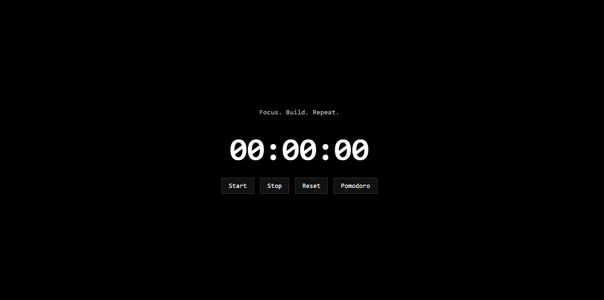

<a name="readme-top"></a>

[![Contributors][contributors-shield]][contributors-url]
[![Forks][forks-shield]][forks-url]
[![Stargazers][stars-shield]][stars-url]
[![Issues][issues-shield]][issues-url]
[![MIT License][license-shield]][license-url]

<br />
<div align="center">
  <a href="https://github.com/ypranay3232/Time-A-productivity-streak-builder">
    
  </a>

<h3 align="center">Time Streak Builder ⏱️🔥</h3>

  <p align="center">
    A local-first VS Code extension to track your coding streaks without the cloud.
    <br />
    <a href="https://github.com/ypranay3232/Time-A-productivity-streak-builder"><strong>Explore the docs »</strong></a>
    <br />
    <br />
    <a href="https://github.com/ypranay3232/Time-A-productivity-streak-builder/issues">Report Bug</a>
    ·
    <a href="https://github.com/ypranay3232/Time-A-productivity-streak-builder/issues">Request Feature</a>
  </p>
</div>

<details>
  <summary>Table of Contents</summary>
  <ol>
    <li>
      <a href="#about-the-project">About The Project</a>
      <ul>
        <li><a href="#built-with">Built With</a></li>
      </ul>
    </li>
    <li>
      <a href="#getting-started">Getting Started</a>
      <ul>
        <li><a href="#prerequisites">Prerequisites</a></li>
        <li><a href="#installation">Installation</a></li>
      </ul>
    </li>
    <li><a href="#usage">Usage</a></li>
    <li><a href="#roadmap">Roadmap</a></li>
    <li><a href="#contributing">Contributing</a></li>
    <li><a href="#license">License</a></li>
    <li><a href="#contact">Contact</a></li>
  </ol>
</details>

## About The Project

[![Product Name Screen Shot][product-screenshot]](https://github.com/ypranay3232/Time-A-productivity-streak-builder)

Time Streak Builder was born out of a simple need: tracking coding productivity without sacrificing privacy. Most tools today are SaaS-based and track your data on their servers. This extension implements DRY (Don't Repeat Yourself) principles for your focus—it just works, locally.

**Why use Time Streak Builder?**
* **Privacy First:** 100% local storage. No APIs. No tracking.
* **Smart Tracking:** Only counts time when you are actually in VS Code.
* **Minimalist:** No cluttered UI—just a clean black stopwatch and rewarding fire animations.

<p align="right">(<a href="#readme-top">back to top</a>)</p>

### Built With

* [![TypeScript][TypeScript.org]][TypeScript-url]
* [![VS Code][VSCode.com]][VSCode-url]
* [![Node][Node.js]][Node-url]

<p align="right">(<a href="#readme-top">back to top</a>)</p>

## Getting Started

To get a local copy up and running for development, follow these steps.

### Prerequisites

* npm
  ```sh
  npm install npm@latest -g
Installation
Clone the repo

Bash

git clone [https://github.com/ypranay3232/Time-A-productivity-streak-builder.git](https://github.com/ypranay3232/Time-A-productivity-streak-builder.git)
Install NPM packages

Bash

npm install
Open in VS Code and press F5 to run the extension.

<p align="right">(<a href="#readme-top">back to top</a>)</p>

Usage
Smart Timer & Streaks
The extension monitors your activity. After 15 minutes of inactivity, it automatically concludes your session and updates your streak.

<div align="center">  </div>

Commands
Use Ctrl + Shift + P to access:

Time Streak Builder: Open Stopwatch

Time Streak Builder: Mark Project Complete

<p align="right">(<a href="#readme-top">back to top</a>)</p>

Roadmap
[ ] Add Custom Theme Support

[ ] Multi-language Support

[ ] Export Data to CSV

[ ] Add Weekly Stats Dashboard

See the open issues for a full list of proposed features.

<p align="right">(<a href="#readme-top">back to top</a>)</p>

Contributing
Contributions are what make the open source community such an amazing place to learn, inspire, and create.

Fork the Project

Create your Feature Branch (git checkout -b feature/AmazingFeature)

Commit your Changes (git commit -m 'Add some AmazingFeature')

Push to the Branch (git push origin feature/AmazingFeature)

Open a Pull Request

<p align="right">(<a href="#readme-top">back to top</a>)</p>

License
Distributed under the MIT License. See LICENSE for more information.

<p align="right">(<a href="#readme-top">back to top</a>)</p>

Contact
Pranay - [@your_handle] - email@example.com

Project Link: https://github.com/ypranay3232/Time-A-productivity-streak-builder

<p align="right">(<a href="#readme-top">back to top</a>)</p>